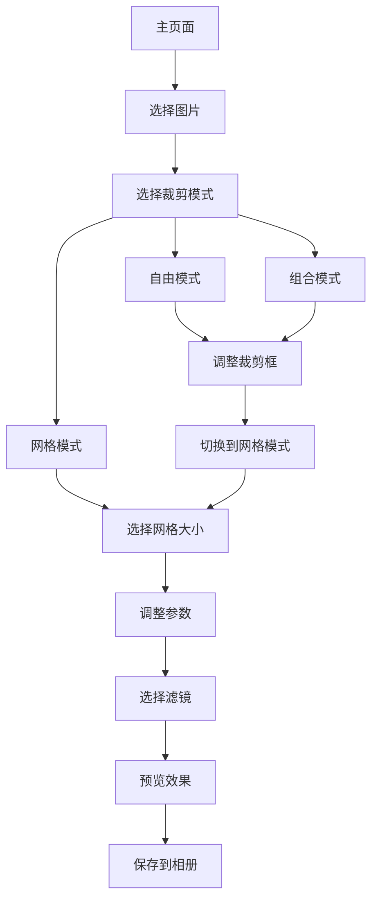

# PicCut - 手机版图片裁剪工具

## 1. Product Overview
PicCut是一个专为移动端设计的在线图片裁剪工具，提供网格化裁剪、自由裁剪、滤镜效果和参数调整功能。
- 解决用户在手机端快速裁剪图片并应用滤镜效果的需求，支持网格布局分割和自由区域裁剪两种模式。
- 目标用户为需要在移动设备上进行图片编辑的普通用户，提供简单易用的图片处理体验。

## 2. Core Features

### 2.1 Feature Module
我们的图片裁剪工具包含以下主要页面：
1. **主页面**：模式切换区、控制面板、参数调整区、图片预览区、操作按钮区

### 2.2 Page Details

| Page Name | Module Name | Feature description |
|-----------|-------------|---------------------|
| 主页面 | 模式切换区 | 提供"网格裁剪模式"和"自由裁剪模式"两种模式切换选项，支持模式间自由切换和组合使用 |
| 主页面 | 控制面板 | 网格模式：提供网格大小选择（3x3、4x4、5x5、2x2）；自由模式：提供裁剪框调整工具 |
| 主页面 | 基础参数调整 | 调整首格间距（5px滑块）、边框粗细（1px滑块）、圆角半径（0px滑块）、边框颜色选择 |
| 主页面 | 滤镜效果 | 提供6种滤镜选项：无滤镜、黑白、怀旧、冷色调、暖色调、鲜艳 |
| 主页面 | 图片上传区 | 支持选择图片按钮，显示上传提示文字，支持JPG、PNG、GIF、WebP格式 |
| 主页面 | 图片预览区 | 网格模式：显示网格预览；自由模式：显示可拖拽调整的裁剪框，支持四角缩放和中心移动 |
| 主页面 | 操作按钮区 | 提供"保存完整拼图到相册"和"保存分割图片到相册"两个功能按钮 |

## 3. Core Process

用户操作流程：
1. 用户进入主页面
2. 点击"选择图片"按钮上传图片
3. 选择裁剪模式（网格裁剪或自由裁剪）
4. 网格模式：选择网格大小并调整参数；自由模式：拖拽调整裁剪框位置和大小
5. 组合模式：先使用自由裁剪确定图片使用区域，再切换到网格模式进行分割
6. 选择滤镜效果
7. 实时预览裁剪效果
8. 保存处理后的图片到相册

## 4. User Interface Design

### 4.1 Design Style
- 主色调：蓝色系（#4F46E5）用于主要按钮和选中状态
- 辅助色：灰色系（#6B7280）用于边框和次要文字
- 按钮风格：圆角矩形，带阴影效果
- 字体：系统默认字体，主要文字14px，次要文字12px
- 布局风格：卡片式设计，左侧控制面板，右侧预览区域
- 图标风格：简洁线性图标，配合emoji表情增加亲和力

### 4.2 Page Design Overview

| Page Name | Module Name | UI Elements |
|-----------|-------------|-------------|
| 主页面 | 模式切换区 | 两个切换按钮，选中状态为蓝色背景，未选中为白色背景灰色边框 |
| 主页面 | 控制面板 | 白色背景卡片，圆角8px，根据选择模式显示不同控制选项，蓝色选中状态 |
| 主页面 | 参数调整 | 滑块控件使用蓝色主题，数值显示在右侧，标签文字左对齐 |
| 主页面 | 滤镜效果 | 6个滤镜按钮采用网格布局，选中状态有蓝色边框高亮 |
| 主页面 | 图片上传区 | 虚线边框矩形区域，中央显示上传图标和提示文字 |
| 主页面 | 预览区域 | 网格模式：网格布局带编号标识；自由模式：半透明遮罩+可拖拽裁剪框，四角有调整手柄 |
| 主页面 | 操作按钮 | 两个主要操作按钮："保存完整拼图到相册"和"保存分割图片到相册"，蓝色背景，白色文字，圆角设计 |

### 4.3 Responsiveness
专为移动端优化的响应式设计，采用移动优先策略，支持触摸交互优化，确保在各种手机屏幕尺寸下都有良好的使用体验。