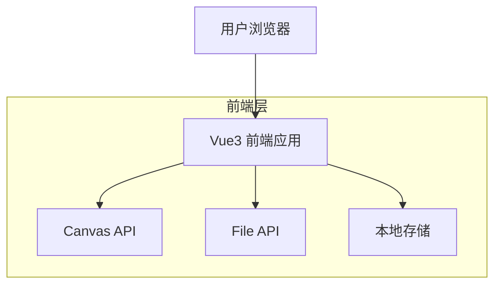
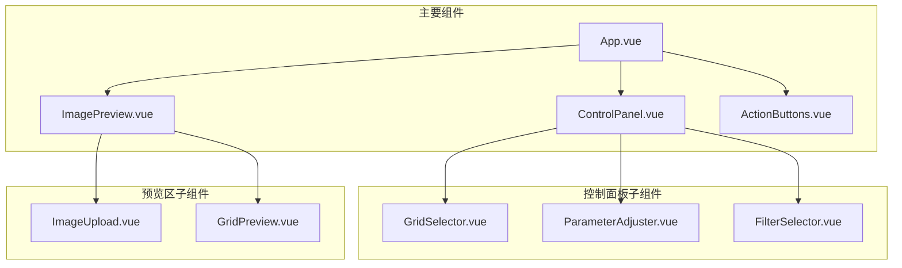

# PicCut - 技术架构文档

## 1. Architecture design



## 2. Technology Description

- Frontend: Vue@3 + TypeScript + Vite + TailwindCSS + Pinia
- 图片处理: Canvas API + HTML5 File API
- 构建工具: Vite
- 样式框架: TailwindCSS
- 状态管理: Pinia
- Backend: None（纯前端应用）

## 3. Route definitions

| Route | Purpose |
|-------|----------|
| / | 主页面，包含所有图片裁剪功能模块 |

## 4. 核心功能模块

### 4.1 图片处理模块
- 图片上传和预览
- Canvas绘制和裁剪（网格裁剪/自由裁剪）
- 滤镜效果应用
- 图片保存到相册（单张/多张）
- 裁剪框交互控制（拖拽、缩放）

### 4.2 UI控制模块
- 裁剪模式切换（网格/自由）
- 网格大小控制
- 自由裁剪框控制
- 参数调整（间距、边框、圆角、颜色）
- 滤镜选择
- 实时预览更新

### 4.3 状态管理
使用Pinia管理应用状态：
- 当前裁剪模式（网格/自由）
- 当前选中的网格大小
- 自由裁剪框位置和尺寸
- 图片处理参数
- 选中的滤镜效果
- 上传的图片数据

## 5. 组件架构



## 6. 数据模型

### 6.1 应用状态接口定义

```typescript
interface AppState {
  // 裁剪模式
  cropMode: 'grid' | 'free'
  
  // 网格配置
  gridSize: '2x2' | '3x3' | '4x4' | '5x5'
  
  // 自由裁剪框配置
  cropBox: {
    x: number // 裁剪框左上角X坐标
    y: number // 裁剪框左上角Y坐标
    width: number // 裁剪框宽度
    height: number // 裁剪框高度
  }
  
  // 基础参数
  parameters: {
    spacing: number // 首格间距 (px)
    borderWidth: number // 边框粗细 (px)
    borderRadius: number // 圆角半径 (px)
    borderColor: string // 边框颜色
  }
  
  // 滤镜效果
  filter: 'none' | 'grayscale' | 'sepia' | 'cool' | 'warm' | 'vibrant'
  
  // 图片数据
  image: {
    file: File | null
    url: string | null
    width: number
    height: number
  }
  
  // 裁剪结果
  croppedImages: string[]
}

interface FilterConfig {
  name: string
  displayName: string
  cssFilter: string
}

interface GridConfig {
  rows: number
  cols: number
  total: number
}
```

### 6.2 核心工具函数

```typescript
// 网格裁剪函数
function cropImageToGrid(
  image: HTMLImageElement, 
  gridConfig: GridConfig, 
  parameters: Parameters
): Promise<string[]>

// 自由裁剪函数
function cropImageFree(
  image: HTMLImageElement,
  cropBox: CropBox,
  filter: FilterConfig
): Promise<string>

// 裁剪框交互函数
function handleCropBoxDrag(event: TouchEvent | MouseEvent, cropBox: CropBox): CropBox
function handleCropBoxResize(event: TouchEvent | MouseEvent, cropBox: CropBox, handle: string): CropBox

// 滤镜应用函数
function applyFilter(
  canvas: HTMLCanvasElement, 
  filter: FilterConfig
): void

// 图片保存到相册函数
function saveImageToGallery(dataUrl: string, filename: string): Promise<void>
function saveMultipleImagesToGallery(images: string[]): Promise<void>

// 参数验证函数
function validateParameters(params: Parameters): boolean
function validateCropBox(cropBox: CropBox, imageSize: {width: number, height: number}): boolean
```

## 7. 性能优化策略

- 使用Canvas进行图片处理，避免DOM操作
- 图片预览使用缩略图，减少内存占用
- 滤镜效果使用CSS filter，提高渲染性能
- 组件懒加载，优化首屏加载速度
- 使用Web Share API或File System Access API保存图片到设备
- 使用Web Workers处理大图片裁剪（可选）